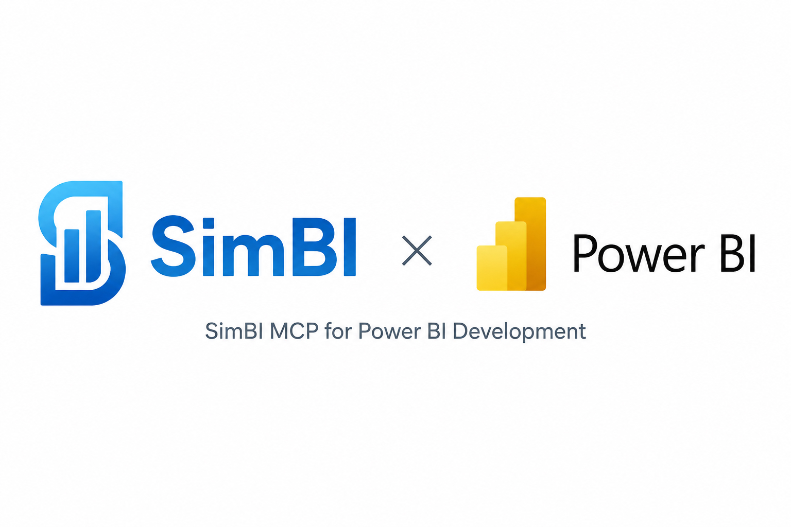

# SimBI MCP

An MCP server that generates Power BI dashboards from natural language. Point it at a CSV, or connect your data to an existing `.pbip` report and describe the dashboard you want, it produces a `.pbip` Report folder that Power BI Desktop can open directly.

## How it works

SimBI chains three phases into two MCP tools and one resource:

```
.pbip created in Power BI Desktop (required first step)
      │
      ▼  [MS Power BI MCP]  ← optional: builds the live semantic model
  Semantic model  ──→  ExportToTmdlFolder → SemanticModel/definition/
      │
      ▼  CLOSE Power BI Desktop  ← mandatory before emit_report
      │
      ▼  parse_schema (reads SemanticModel/definition/)
  ModelSchema JSON
      │
      ▼  [Claude reads simbi://annotation-vocabulary and generates HTML in-context]
  Annotated HTML mockup  (data-pbi-* annotations)
      │
      ▼  validate_mockup_html  ← cheap lint before render
      │
      ▼  emit_report (pbip_path → existing .pbip)
  <name>.Report/   (Playwright renders HTML → extracts bounding boxes → writes PBIR files)
      │
      ▼  Open .pbip fresh in Power BI Desktop
  Live dashboard
```

**SimBI only writes the `.Report/` folder.** The `.pbip` and `.SemanticModel/` must already exist before calling `emit_report` — Power BI Desktop creates them. SimBI never creates or modifies the `.pbip` file itself.

**Power BI Desktop must be closed before `emit_report` runs.** While the file is open, Power BI Desktop caches the Report in memory and ignores any disk writes to the `.Report/` folder. Always close first, emit, then open fresh.

## Prerequisites

- Python 3.11+
- [uv](https://docs.astral.sh/uv/)
- Google Chrome (system install — used by Playwright for PBIR layout extraction)
- The [Microsoft Power BI MCP](https://github.com/microsoft/power-bi-mcp) configured in your MCP client (for semantic model creation)

## Installation

```bash
git clone https://gitlab.com/ds-simbi/simbi-mcp.git
cd simbi-mcp
uv sync
```

## Running the server

```bash
uv run simbi-mcp
```

The server speaks the MCP stdio protocol. Configure it in Claude Desktop or Claude Code alongside the Microsoft Power BI MCP.

### Claude Desktop config example

```json
{
  "mcpServers": {
    "simbi": {
      "command": "uv",
      "args": ["run", "--directory", "/path/to/SimBI MCP", "simbi-mcp"]
    },
	  "powerbi-modeling-mcp": {
			"type": "stdio",
			"command": "npx",
			"args": [
				"-y",
				"@microsoft/powerbi-modeling-mcp@latest",
				"--start"				
			]
		}	
  }
}
```

## Resource

### `simbi://annotation-vocabulary`

The `data-pbi-*` HTML annotation spec and CSS class catalog. Claude reads this once per session to learn how to annotate visuals and which layout classes are available. No tool call needed — it's reference data.

## Tools

### `parse_schema`

Converts a TMDL string (from the Power BI MCP's `ExportTMDL` operation) into a SimBI schema JSON that the other tools consume.

```
Input:  tmdl: str
Output: ModelSchema JSON string
```

### `emit_report`

Renders an annotated HTML mockup in Chrome, extracts visual bounding boxes, and writes the `.Report/` folder beside an existing `.pbip`.

```
Input:  html: str, schema_json: str, pbip_path: str
Output: absolute path to <name>.Report/  ← the written report folder
Needs:  system Chrome
```

`pbip_path` must point to an **existing** `.pbip` file (or a folder containing exactly one). Pass the `.pbip` that Power BI Desktop created — SimBI writes the sibling `.Report/` folder and leaves the `.pbip` and `.SemanticModel/` untouched.

**Prerequisites:**
- Power BI Desktop must be **closed** before calling this tool.
- The `.pbip` must already exist (created by Power BI Desktop).

## End-to-end usage

`emit_report` writes the `.Report/` folder beside your existing `.pbip`:

```
<project_dir>/
  <name>.pbip                ← created by Power BI Desktop (required before emit_report)
  <name>.Report/             ← written by SimBI
  <name>.SemanticModel/      ← created by Power BI Desktop or the MS Power BI MCP
```

Use a dedicated project folder — **not** the SimBI MCP repo. For example: `C:/Reports/SalesDashboard/`.

---

### Path 1 — SimBI only (no MS Power BI MCP needed)

SimBI generates the report layout from a TMDL description you provide. No live Power BI Desktop connection required. Visuals open in PBI Desktop but show empty data until you connect a source.

**Step 1 — Create the .pbip in Power BI Desktop.**

Open Power BI Desktop → File → New. Then File → Save As, choose **Power BI Project** format, save to your output folder:

```
C:\Reports\SalesDashboard\SalesDashboard.pbip
```

**Step 2 — Close Power BI Desktop.**

**Step 3 — Prompt Claude:**
```
The file C:\Reports\SalesDashboard\SalesDashboard.pbip exists and Power BI Desktop is closed.

Build a sales dashboard from this TMDL — measures: Total Revenue (SUM of Revenue),
Order Count (COUNTROWS), Avg Unit Price (Revenue / Units). Columns: Region, OrderDate,
Revenue, Units, Category.

1. Call parse_schema with the TMDL below
2. Generate annotated HTML with db-page/db-grid/db-card/db-chart-area classes
3. Call validate_mockup_html
4. Call emit_report with pbip_path = "C:\Reports\SalesDashboard\SalesDashboard.pbip"

TMDL: <paste your table TMDL here>
```

**What Claude does:**
1. Calls `parse_schema` with the TMDL
2. Generates the annotated HTML mockup in-context
3. Calls `validate_mockup_html`
4. Calls `emit_report(pbip_path="C:/Reports/SalesDashboard/SalesDashboard.pbip")`

**Step 4 — Open the .pbip fresh in Power BI Desktop.**

Visuals render but show empty data — use Home → Transform data to connect `sales.csv`.

**Output:**
```
C:/Reports/SalesDashboard/
  SalesDashboard.pbip        ← created by you in Step 1
  SalesDashboard.Report/     ← written by SimBI
  SalesDashboard.SemanticModel/   ← created by Power BI Desktop (stub)
```

---

### Path 2 — MS Power BI MCP builds the semantic model, SimBI builds the report

The MS Power BI MCP builds the full live semantic model (measures, calculated tables, relationships, loaded data). SimBI generates the report layout. The result is a fully data-connected report.

> **Ordering is critical and non-negotiable:**
> 1. Power BI Desktop must be **open** while the MCP builds the model
> 2. **ExportToTmdlFolder must be called** to sync the model to disk before closing
> 3. Power BI Desktop must be **closed** before SimBI runs `emit_report`
> 4. Open the `.pbip` **fresh** after SimBI finishes — never reload a file that was open during emit

**Step 1 — Create and open the .pbip in Power BI Desktop.**

File → New → File → Save As → Power BI Project format:
```
C:\Reports\SalesDashboard\SalesDashboard.pbip
```
Leave Power BI Desktop **open** for the next step.

**Step 2 — Build the semantic model with the MS Power BI MCP:**
```
The file C:\Reports\SalesDashboard\SalesDashboard.pbip is open in Power BI Desktop.

Use the Power BI MCP to:
1. Connect to the running Power BI Desktop instance
2. Refresh data to load C:\Reports\SalesDashboard\Data\sales.csv
3. Create a Calendar calculated table:
   ADDCOLUMNS(CALENDARAUTO(), "MonthName", FORMAT([Date], "MMM YYYY"), ...)
4. Create a relationship from sales[OrderDate] (Many) to Calendar[Date] (One)
5. Mark Calendar as the date table
6. Create measures: Total Revenue, Order Count, Avg Unit Price
7. Full model refresh
8. ExportToTmdlFolder → C:\Reports\SalesDashboard\SalesDashboard.SemanticModel\definition
```

Step 8 is essential — without it, all model changes exist only in Power BI Desktop's memory and will be lost when the file is next opened.

**Step 3 — Close Power BI Desktop.**

Mandatory. SimBI's writes to `.Report/` are silently ignored by a running Power BI Desktop instance — it serves its cached in-memory report until a fresh open.

**Step 4 — Generate the report with SimBI:**
```
Power BI Desktop is now closed.

Use SimBI to build a sales dashboard:
1. parse_schema from C:\Reports\SalesDashboard\SalesDashboard.SemanticModel\definition
2. Generate HTML using db-page, db-grid, db-card, db-chart-area classes
   (every visual needs real CSS dimensions — zero-size elements are rejected)
3. validate_mockup_html
4. emit_report with pbip_path = C:\Reports\SalesDashboard\SalesDashboard.pbip
```

**Step 5 — Open the .pbip fresh in Power BI Desktop.**

Both the semantic model and the report are read from disk on cold open — all visuals appear with live data immediately, no refresh needed.

**Output:**
```
C:/Reports/SalesDashboard/
  SalesDashboard.pbip
  SalesDashboard.Report/
    definition/pages/<guid>/visuals/   ← visual.json files
  SalesDashboard.SemanticModel/
    definition/
      tables/Calendar.tmdl             ← calculated date table
      tables/sales_small.tmdl          ← measures + partition
      relationships.tmdl               ← active Calendar relationship
```

---

### Smoke-test the server locally

```bash
uv run simbi-mcp
```

The server starts silently (stdio protocol). Ctrl+C to exit. If it starts without errors the entry point and imports are working.

## Development

```bash
# Run unit tests (no API key or Chrome needed)
uv run pytest tests/unit/ -v

# Run integration tests (Chrome required)
uv run pytest -m integration -v

# Lint and typecheck
uv run ruff check src tests
uv run mypy src
```

## Project structure

```
src/simbi_mcp/
├── server.py          MCP tools (FastMCP)
├── semantic/          Phase 1: dataset profiling, measure planning, MS MCP adapter
├── mockup/            Phase 2: HTML generator, annotation vocabulary, validator
└── pbir/              Phase 3: DOM extractor, visual JSON templates, PBIR writer
```

## Supported visual types

| Annotation | Power BI visual | Fields |
|---|---|---|
| `card` | Card | `data-pbi-measure` |
| `columnChart` | Clustered column chart | `data-pbi-axis`, `data-pbi-values` |
| `barChart` | Clustered bar chart | `data-pbi-axis`, `data-pbi-values` |
| `lineChart` | Line chart | `data-pbi-axis`, `data-pbi-values`, `data-pbi-series` (optional) |
| `slicer` | Button slicer | `data-pbi-field` |
| `table` | Table | `data-pbi-columns` (comma-separated — each token is either a bare measure name or a `Table[Column]` ref) |

## License

[MIT](LICENSE) © Nick Lombardi
